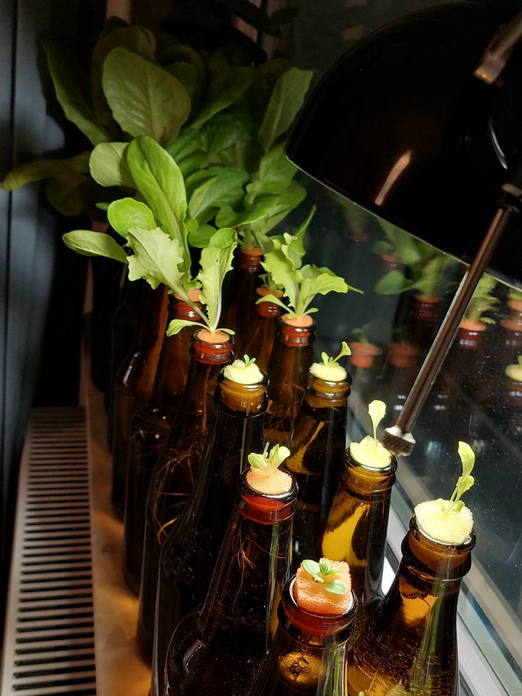
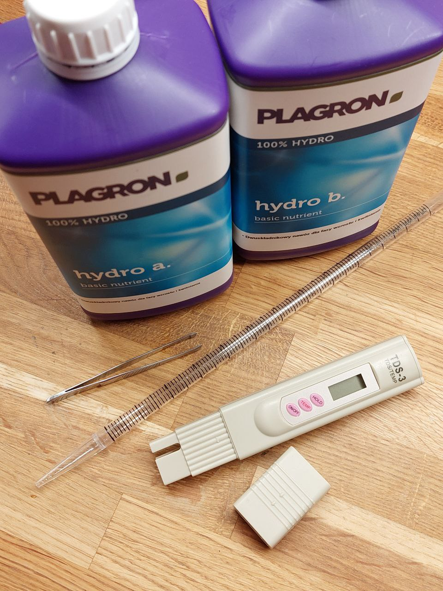
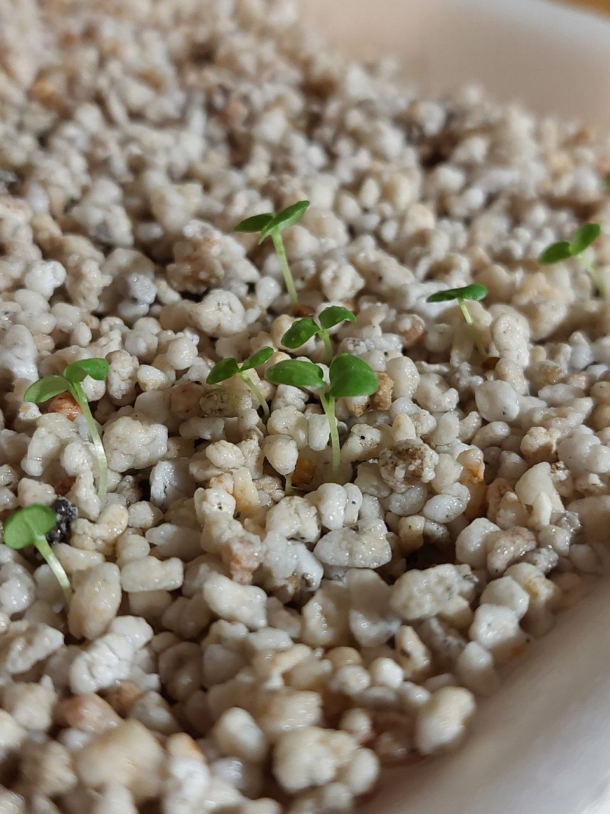
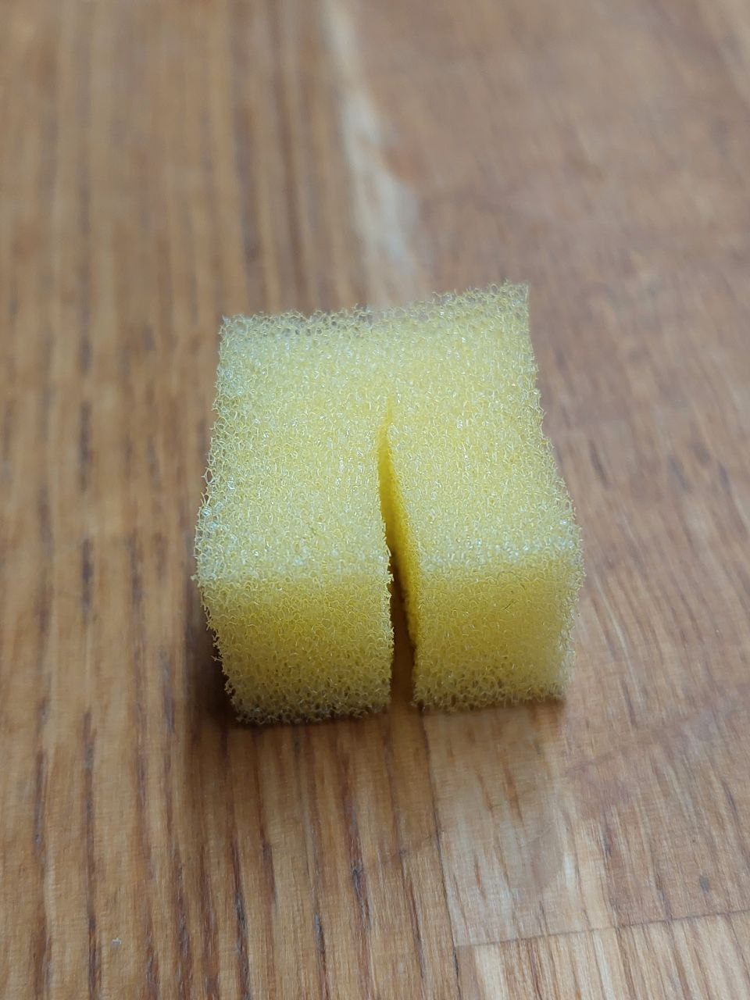
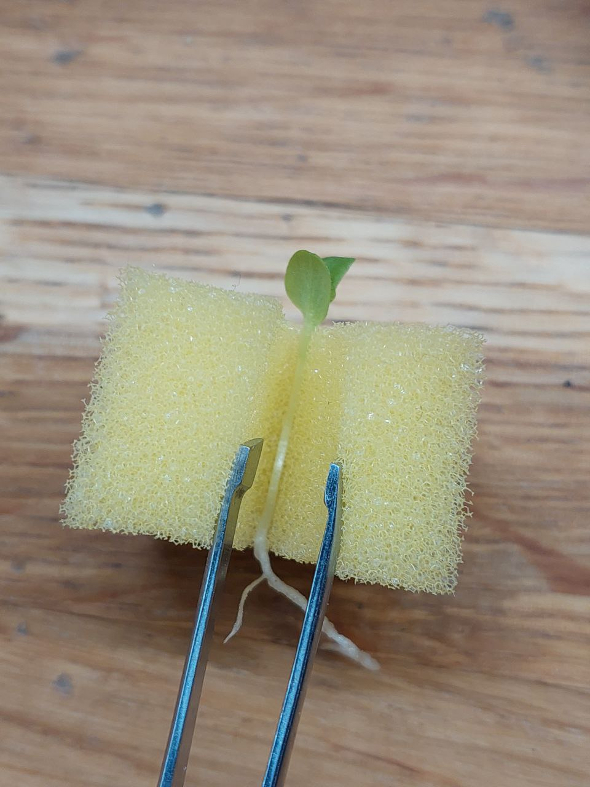
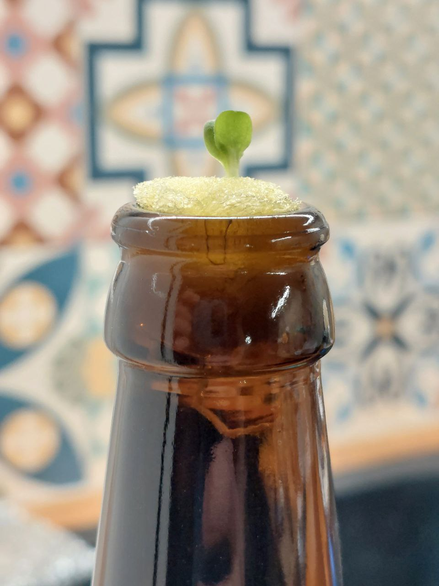
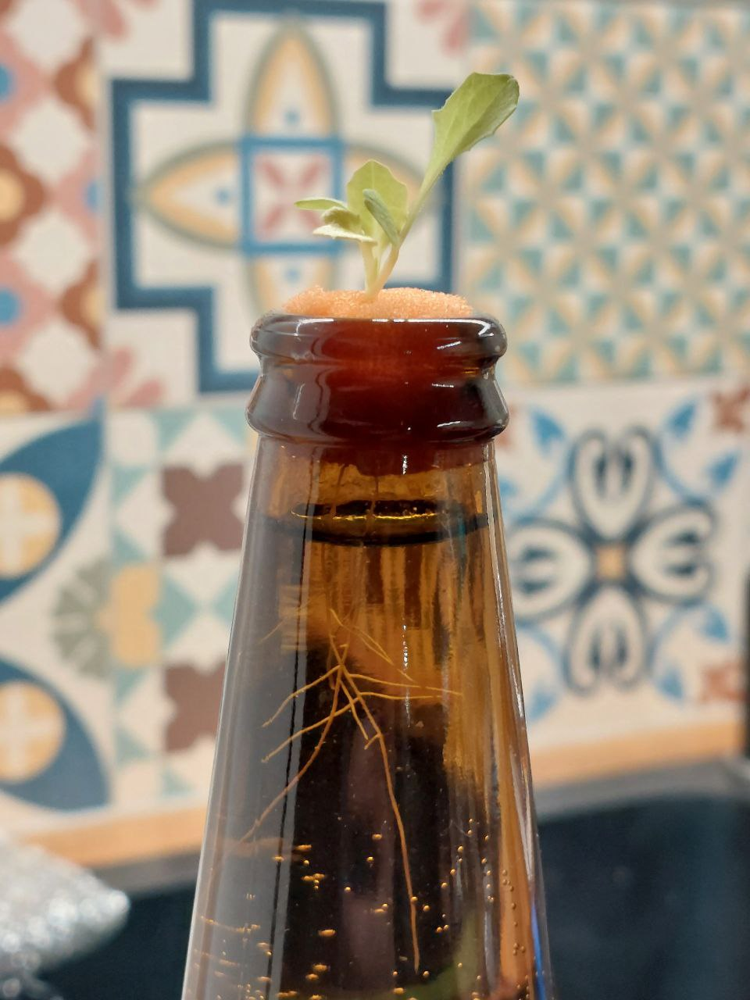
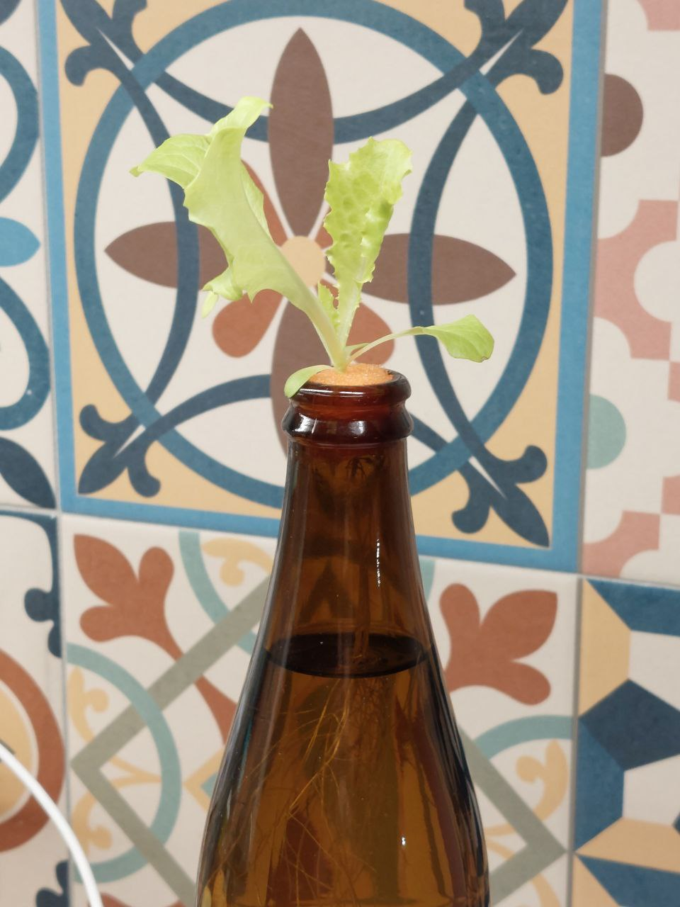
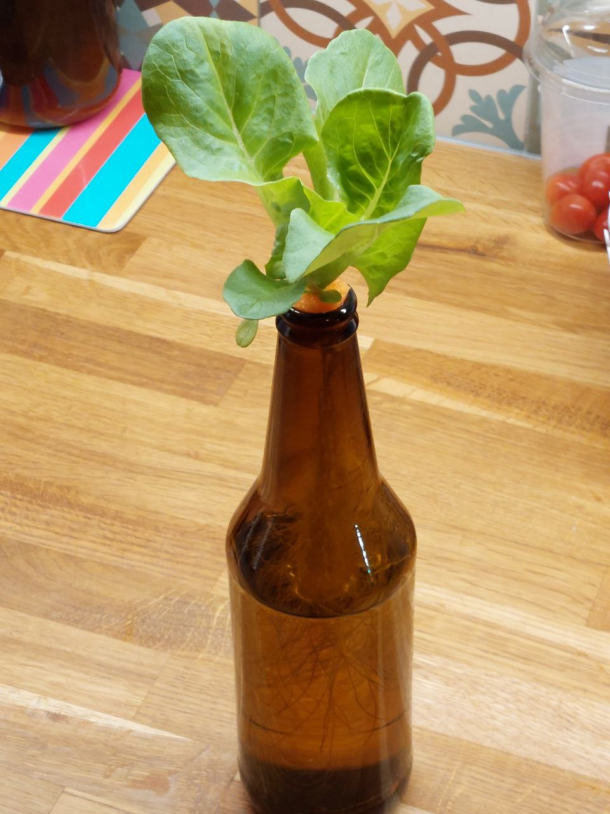
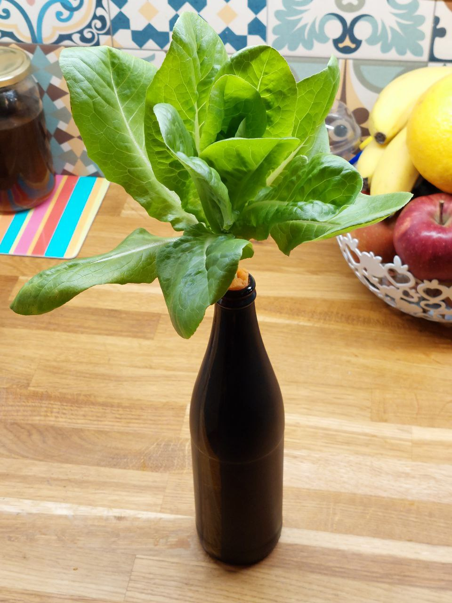

# Butelkowa uprawa hydroponiczna

## Teoria

### Co to jest hydroponika?

W najprostszych słowach: hydroponika to sposób uprawy, w którym zamiast gleby wykorzystujemy wodę. Sama woda oczywiście nie wystarczy - roślinom należy zapewnić dostęp do składników odżywczych, które "normalnie" pobierane są z gleby.

### Dlaczego hydroponika?

Przede wszystkim dlatego, że jest to sposób hodowli, który wymaga znacznie mniejszego (codziennego) nakładu pracy, niż klasyczna uprawa w glebie. Zużywa zdecydowanie mniej wody, zapewnia za to bardzo dużą powtarzalność warunków.

### Metoda Kratky'ego

Istnieje [wiele metod](https://en.wikipedia.org/wiki/Hydroponics#Techniques) uprawy hydroponicznej, różniących się stopniem zaawansowania technologicznego i złożoności. Oczywiście, techniki stosowane do przemysłowej hodowli na wielką skalę są mało przydatne dla miłośników domowej zieleni, analogicznie, domowe uprawy niezbyt skutecznie skalują się w górę. Każdej z metod przyświeca natomiast jeden cel: wyhodowanie zdrowej i obfitej rośliny, poprzez zapewnienie jej optymalnej kombinacji wody, światła, powietrza i składników odżywczych.

Najprostszym, według mnie, sposobem uprawy hydroponicznej jest metoda Kratky'ego, opracowana przez Bernarda Kratky'ego z Uniwersytetu Hawajskiego. W tym systemie roślina jest zawieszona nad lustrem wody - część korzeni znajduje się w wodzie, a część wisi w powietrzu. Korzenie, oprócz tego, że pobierają wodę i sole mineralne, potrzebują także dostępu do tlenu - gdybyśmy całą dolną część rośliny zanurzyli w stojącej wodzie, zwiastowałoby to jej niechybny koniec (kto przelał ulubionego kwiatka kończąc w ten sposób jego żywot, ten dobrze o tym wie). Roślina pobierając niezbędną wodę, obniża jej poziom w zbiorniku, a jednocześnie wypuszcza coraz dłuższe korzenie - samoregulujący się mechanizm.

Istnieją systemy hydroponiczne typu DWC (deep water culture - hodowla w głębokiej wodzie), gdzie całość korzeni znajduje się pod wodą - ale woda jest ciągle napowietrzana z wykorzystaniem pomp. Prosta idea, ale wymagająca jednak dodatkowego osprzętu i zasilania. Zostańmy więc przy całkowicie pasywnej metodzie Kratky'ego, gdzie górna część korzeni ma dostęp do atmosferycznego tlenu, a dolna - wody i rozpuszczonego w niej nawozu.

W idealnej wersji metody Kratky'ego, zbiornik którego użyjemy do hodowli powinien zapewnić ilość wody wystarczającą na cały cykl rozwojowy rośliny. Dla sałaty jest to pomiędzy 3 i 6 litrów na jedną roślinę. Łatwo znaleźć taki zbiornik, ale na pewno nie jest on kompatybilny z hodowlą parapetową. Trzeba się więc pogodzić z faktem, że stosując butelki lub inne pojemniki o mniejszej pojemności, co jakiś czas trzeba będzie uzupełnić płyn. Jest to o tyle łatwiejsze od podlewania roślin hodowanych w glebie, że nie ma obaw o dostarczenie zbyt małej lub zbyt dużej ilości wody - a sama częstotliwość uzupełniania roztworu jest kilkukrotnie mniejsza. Młodym roślinom poradzenie sobie z pierwszą butelką może zająć nawet ponad miesiąc. Z rozbudowanym system korzeniowym sięgającym aż do dna i przy mocnym świetle, sałata jest w stanie wciągnąć pół litra w ok. 1,5 tygodnia.

### Podstawowe parametry roztworu - EC i TDS

Stężenie roztworu (czyli zawartość nawozu w wodzie) określa się za pomocą parametru [EC](https://en.wikipedia.org/wiki/Electrical_conductivity_meter) (electrical conductivity) lub [TDS](https://en.wikipedia.org/wiki/Total_dissolved_solids) (total dissolved solids). Miernik EC/TDS (konduktometr) można kupić za kilkadziesiąt złotych na popularnym serwisie aukcyjnym. Pomiar odbywa się na zasadzie badania przewodności elektrycznej pomiędzy dwiema zanurzonymi w cieczy elektrodami i jest natychmiastowy. Wsadzamy miernik do roztworu tak, żeby elektrody były całkowicie zanurzone, potrząsamy aby usunąć bąbelki powietrza, odczytujemy wartość z wyświetlacza.

Żeby przeliczyć EC na TDS, musimy pomnożyć wartość EC przez `500`. I tu zaczynają się schody, bo mnożąc przez `500`, otrzymujemy wynik w jednostkach `ppm 500`. Inną popularną skalą jest `ppm 700`, a można też spotkać `ppm 650` - mnożymy wtedy EC odpowiednio przez `700` i `650`. Trzeba więc zachować czujność i upewnić się, że miernik którego używamy i przepis wg. którego przygotowujemy roztwór wykorzystują tę samą skalę. Z EC jest trochę łatwiej - EC jest tylko jedno i zawsze oznacza to samo.

### Nawożenie

Tutaj należy przede wszystkim znać ulubione stężenie nawozu dla naszej rośliny, oraz oczywiście zapoznać się z instrukcją dawkowania dostarczaną przez producenta. Nawozy hydroponiczne są zazwyczaj dwuskładnikowe i silnie stężone, tzn. maksymalna dawka każdego to ok 2-3 mililitry na litr wody. Litr nawozu powinien więc spokojnie wystarczyć na kilkaset butelek.

Puryści sztuki hydroponicznej odradzają stosowanie nawozów dedykowanych do hodowli w glebie, aczkolwiek w ramach eksperymentu - można. Ja nie próbowałem. Takie nawozy są tworzone z założeniem, że część mikro/makroelementów dostarczy gleba, przez co może w nich brakować niektórych składników potrzebych roślinie.

W swojej hodowli używam nawozu marki Plagron. To nie reklama - kupiłem, bo to pierwszy który został mi zasugerowany podczas internetowych poszukiwań. Działa. Spotkałem się też z dobrymi opiniami o produktach firmy Canna.

### Woda

Osobiście, używam zimnej wody prosto z kranu. Część plantatorów sugeruje używanie wody odstanej przez 24 godziny lub wygotowanej przez kilka minut, aby pozbyć się chloru - tak jak to robią akwaryści.

Gotowanie ani odstanie nie zmienią jednak znacznie zawartości soli mineralnych w wodzie wodociągowej. U mnie woda z "rury" zazwyczaj legitymuje się parametrem TDS w okolicy `300-350 ppm` i jest to relatywnie wysoka wartość, ale nie zauważyłem żadnych negatywnych skutków podczas jej stosowania. W teorii, sole mineralne zawarte w kranówce nie powinny wpływać na wzrost roślin. Jest to natomiast pewnego rodzaju niekontrolowana zmienna, którą można wyeliminować poprzez stosowanie wody destylowanej (TDS w okolicy zera) lub filtra osmotycznego (redukcja wejściowego TDS o `>90%`).

Należy mieć na uwadze, że jeśli przepis mówi że potrzebujemy roztworu zawierającego `700 ppm` nawozu, to używając wody która sama w sobie ma przewodność na poziomie `250 ppm`, ostatecznie dążymy do osiągnięcia wartości `950 ppm` na mierniku.

### Kilka słów o pH

Aby roślina mogła w najbardziej efektywny sposób przyswajać składniki odżywcze z roztworu, powinien on cechować się odpowiednią kwasowością lub zasadowością. Na większości stron o hodowli hydroponicznej, oprócz odpowiedniego poziomu EC/PPM, znajdziemy też informację o ulubionym pH danej rośliny.

Zdecydowana większość preferuje środowisko lekko zakwaszone, tj. wartość pH mieści sie w przedziale między `5` a `7`. Możemy oczywiście regulować kwasowość/zasadowość naszego roztworu za pomocą preparatów "pH up" i "pH down". Ja z tej regulacji zrezygnowałem - woda z mojego kranu cechuje się wartością pH w okolicy `6,6`, co nie powinno w żaden sposób negatywnie wpływać na wzrost roślinek.

W roku AD 2022, pH mierzymy za pomocą miernika, podobnego do miernika TDS. Różnica jest taka, że trzeba zostawić go w wodzie na kilkadziesiąt sekund/kilka minut, aby odczyt się ustabilizował - mierzona wartość nie zmienia się momentalnie. Miłośnicy klasyki mogą skusić się na pomiar za pomocą papierków lakmusowych, aczkolwiek dokładność takiego pomiaru będzie bardzo mizerna, tymbardziej że nie poruszamy się tutaj po całej skali pH od `0` do `14`, a tylko po małym jej wycinku, mniej więcej pomiędzy `5` i `8`.

Zazwyczaj problemem jest zbyt wysokie pH i trzeba nasz roztwór lekko zakwasić. Kwasek cytrynowy, czy to w postaci białych kryształków, czy świeżo wyciśniętej cytryny na krótką chwilę spełni to zadanie, ale bardzo szybko rozpada się w roztworze i po kilku dniach pH wróci do oryginalnej wartości - odradza się więc jego stosowanie. Oprócz gotowych produktów do kontroli pH, spotkałem się ze stosowaniem silnie rozrzedzonych "czystych" kwasów: siarkowego lub azotowego. Jeśli ktoś zdecyduje się na taki krok, to oprócz zachowania wszelkich środków ostrożności i ochrony osobistej, zalecam umiar i cierpliwość w dodawaniu ich do roztworu - łatwo przedobrzyć. Przed każdym pomiarem, czy to pH czy EC, należy nasz roztwór dobrze zamieszać.

### O podłożach

Podłoże do hodowli hydroponicznej różni się od gleby tym, że jego rola jest zdecydowanie mniejsza - co nie znaczy, że nieistotna. Podłoże powinno być przede wszystkim jałowe, tzn. ma nie zmieniać parametrów roztworu hydroponicznego i samo z siebie nie dostarczać roślinie żadnych składników. Popularne podłoża to keramzyt (LECA), wełna mineralna, perlit, wermikulit, żwir, włókno kokosowe... i wiele innych. Lista jest długa, każde z nich ma swoje wady i zalety - większość z nich stosuje się jednak do hodowli w doniczkach (kubeczkach) hydroponicznych. Ja uparłem się jednak na butelki, które zdecydowanie nie są kompatybilne z żadnymi doniczkami ani kubeczkami. Idealnym rozwiązaniem okazały się tutaj gąbki. O ich przygotowaniu - w części praktycznej.

## Praktyka

Czyli jak bezglebowo hodować sałatę/rukolę/roszponkę/bazylię w butelkach na parapecie.

### Co jest potrzebne

- Nasiona tego, co chcemy wyhodować.
- Do kiełkowania:
  - styropianowa tacka lub inny płytki pojemnik,
  - perlit lub ręcznik papierowy.
- Butelki po piwie, pojemność `0,5` litra, z ciemnego szkła.
- Gąbka.
- Nawóz do hydroponiki.
- Pipeta/strzykawka.
- Miska, garnek lub inne naczynie (do mieszania roztworu).
- Lejek.
- Opcjonalnie:
  - miernik TDS/EC,
  - miernik pH,
  - pinceta,
  - przykrywka do tacki,
  - lampa do roślin.

### Kiełkowanie

Pierwszy etap hydroponicznej przygody to zamiana nasion w kiełki. Na tackę sypiemy ok. 0,5 cm perlitu, wysiewamy nasiona, przysypujemy taką samą warstwą. Teraz należy całość zwilżyć - ostrożnie, żeby wszystko nie popłynęło. Suchy perlit łatwo zdmuchnąć, jest on też na tyle lekki że potrafi unosić się na wodzie. Całość powinna być wilgotna, na dnie powinna być cienka warstwa wody.

Jeśli nie dysponujemy perlitem lub nie chcemy go używać (nie jest to materiał odnawialny), możemy wysiać nasiona na ręczniku papierowym. Proces kiełkowania przebiega podobnie, ale należy często upewniać się czy nasiona mają wilgotno - perlit zdecydowanie dłużej trzyma wilgoć. Większą ostrożność należy też zachować przy wyciąganiu roślin - korzenie mocno wgryzają się w ręcznik i łatwo je urwać lub uszkodzić.

Całość pozostawiamy w temperaturze pokojowej, w jasnym, ale nie bezpośrednio nasłonecznionym miejscu. Tackę można zamknąć w foliowym worku lub przykryć (przezroczystą) pokrywką, nie trzeba wtedy tak często kontrolować wilgotności. Bez przykrycia - warto codziennie dolać odrobinę wody, tak aby nasiona nie wysychały.

Po kilku dniach powinniśmy zobaczyć pierwsze kiełki. Przed przejściem do następnego etapu, rośliny powinny wystawać ok. 2 cm ponad podłoże i posiadać podobnej długości korzeń. Osiągnięcie takiej wysokości sałacie i bazylii zajmuje około 2 tygodni. Rukola jest dużo szybsza, a na roszponkę trzeba poczekać trochę więcej czasu.

Jeśli kiełkujące rośliny mają zbyt mało światła, wyciągają się bardzo mocno do góry - nie jest to pożądana cecha, mogąca skutkować złamaniem lub wywróceniem rośliny podczas dalszego wzrostu. Przy nadmiarze światła, wzrost (pionowy) może zakończyć się przedwcześnie i łodyga może być krótsza niż gąbka w której mamy zamiar ją zamontować.

Na etapie kiełkowania mała roślina jest samowystarczalna, tzn. wszystkie potrzebne jej składniki odżywcze pochodzą z nasiona i nie ma konieczności dostarczania jej nawozu.

### Przygotowanie roztworu

Mając miernik w ręce, proces przygotowania roztworu jest banalny.

1. Określamy docelowe stężenie roztworu w EC lub PPM. Najłatwiej wykorzystać do tego celu wyszukiwarkę internetową. Zapytanie w stylu `hydroponics lettuce ec/ppm/tds` szybko dostarczy nam odpowiedniej informacji.
2. Wlewamy do miski potrzebną nam ilość wody. Kranowej, filtrowanej, destylowanej - wolny wybór.
3. Mierzymy początkowe EC/PPM.
4. Za pomocą strzykawki lub pipety dodajemy nawóz do wody. Proponuję zacząć powoli, tzn. dodać ok. `1 ml` na litr wody, dobrze wymieszać i zmierzyć EC/TDS. Wzrost EC/TDS jest liniowo proporcjonalny do ilości dodanego nawozu, tak więc, przykładowo, jeśli dodaliśmy `1 ml` na litr i PPM wzrosło o `120`, a chcemy zwiększyć je o `600`, w drugim rzucie musimy dodać jeszcze ok. `4 ml` nawozu na każdy litr wody. `4 ml` razy `120 ppm` daje nam brakujące `480 ppm`.
5. Jeśli chcesz wyregulować pH roztworu - teraz jest odpowiedni moment.
6. W rozlewaniu roztworu do butelek bardzo pomaga lejek. Jeśli ktoś nie potrzebuje - czapki z głów!

### Gąbki

Nasze medium hydroponiczne, substytut gleby. Zwykłe, najzwyklejsze gąbki - kąpielowe lub kuchenne. Gąbka trzyma roślinę za punkt, gdzie łodyga przechodzi w korzeń - robi dokładnie to, czego od niej oczekujemy.

Przygotowanie sprowadza się do tego, aby ostrym nożem pokroić gąbkę w małe sześciany o boku ok. `2 cm` - tak żeby dało się je wsadzić do szyjki od butelki po piwie, ale żeby po wsadzeniu nie było ryzyka, że taka kostka wpadnie do środka. Kostkę musimy naciąć wzdłużnie do ok. `2/3` jej grubości, aby móc umieścić w niej łodygę rośliny.

### Butelki

Do uprawy hydroponicznej metodą Kratky'ego możemy użyć w zasadzie dowolnego pojemnika, aczkolwiek niektóre są lepsze od innych. Ja zdecydowałem się na wykorzystanie butelek po piwie - ze względu na ich bardzo łatwą dostępność. Przygotowanie takiej butelki to nic trudnego - dobrze wypłukujemy środek, usuwamy etykiety (chyba, że ktoś lubi podziwiać logo swojego ulubionego złocistego napoju). Ze względu na to, że roztwór nawozu w połączeniu ze światłem może się szybko zazielenić, tzn. stać się hodowlą alg - zaleca się stosowanie wyłącznie ciemnego szkła. Dla pewności, można butelki pomalować czarną farbą w sprayu, tak aby żadne światło nie dostawało się do środka - warto natomiast zostawić sobie jakieś okienko, aby obserwować postępy w rozwoju systemu korzeniowego.

Pierwszą partię moich butelek skrzętnie pomalowałem czarnym sprayem. Przy następnych rozsadach nie byłem już aż tak skrupulatny i, brzydko mówiąc, olałem ten etap. Póki co, nie stwierdziłem obecności zieleniny w żadnej butelce, nawet w przezroczystej. Być może to kwestia szczelnego zatkania butelek przez gąbki, może w miejscu gdzie mieszkam w powietrzu nie fruwa zbyt wiele alg, a może to kwestia nawozu, którego algi nie lubią. Internet jest natomiast pełen fotografii przedstawiających glony i algi rosnące w zbiornikach hydroponicznych, nawet jeśli światło dostawało się do roztworu tylko w minimalnych ilościach, tak więc dla świętego spokoju, lepiej im to uniemożliwić. Rozwój alg to nic strasznego, ale ich nadmierne nagromadzenie w roztworze może spowolnić i utrudnić prawidłowy rozwój rośliny.

### Przesadzanie

Sprawa prosta, aczkolwiek wymagająca subtelności i finezji.

Małą roślinkę łapiemy palcami za łodygę i wyciągamy z podłoża w którym kiełkowało, dbając o to, aby nie urwać delikatnych korzeni. Wsadzamy do gąbki, a gąbkę umieszczamy w szyjce butelki wypełnionej roztworem - warto pomóc sobie pincetą. Kluczową sprawą jest upewnienie się, że korzenie rośliny są przynajmniej częściowo zanurzone w roztworze - w przeciwnym wypadku, roślina uschnie w klika godzin.

W pierwszych dniach warto zerkać, czy poziom wody nie obniżył się zbyt mocno. Ze względu na małą średnicę szyjki naszej piwnej butelki, utrata kilku mililitrów może sprawić, że korzenie przestaną sięgać do życiodajnego nektaru.

### Wzrost

Roślinka jest już wystarczająco duża, żeby poradzić sobie sama. Przez następne kilka tygodni możemy śledzić jak z łodygi wyrastają i powiększają się kolejne listki. Poziom roztworu w butelce opada, a korzenie wydłużają się, goniąc uciekającą powierzchnię wody.

Niezbędnym składnikiem fotosyntezy, jak sama nazwa wskazuje, jest oczywiście światło. Roślina powinna mieć dostęp do dużej ilości dziennego światła - południowy parapet będzie idealnym rozwiązaniem (jeśli oczywiście roślina lubi bezpośrednie nasłonecznienie). Jeśli nie mamy południowego parapetu, pogoda nie dopisuje, jesteśmy gdzieś pomiędzy październikiem a marcem - warto zapewnić roślinie alternatywne, sztuczne źródło światła. Biurkowa lampka z kilku-watową, białą żarówką LED lub lampa dedykowana do uprawy roślin będzie tutaj wystarczająca. Dobrze, jeśli cykl świecenia będzie zbliżony do naturalnego cyklu dobowego, choć dokładna proporcja "dnia" do "nocy" jest zależna od rośliny którą hodujemy. Współczesne lampy LED nie emitują zbyt wiele ciepła, ale należy unikać podgrzewania roślin przez źródło światła - wysuszenie liści może powodować ich więdnięcie.

### Dolewka

Szybki wzrost w optymalnych warunkach może doprowadzić do sytuacji, gdzie na dnie butelki zostaną ostatnie 2 lub 3 centymetry roztworu - to znak, że czas na dolewkę.

Nie ma w tym żadnej filozofii:
1. Przygotowujemy roztwór.
2. Delikatnie podnosimy roślinę wraz z gąbką z szyjki butelki na 2-3 centymetry w górę.
3. Używając lejka dolewamy roztworu. Nie do pełna - zalewając butelkę "pod korek" odetniemy korzeniom dostęp do tlenu! Najlepiej wypełnić butelkę pomiędzy połową a 2/3 jej objętości.
4. Umieszczamy roślinę i gąbkę z powrotem w szyjce.

Wyrośnięte (dorosłe) rośliny nie burzą się, jeśli zamiast roztworem zawierającym nawóz, zostaną podlane czystą wodą lub słabszym roztworem. Oczywiście spowolni to ich wzrost, ale po następnej podmianie na bogatszy w składniki roztwór, wszystko będzie toczyć się dalej normalnym tempem. "Zielenina" dobrze toleruje takie numery, ale jeśli ktoś hoduje pomidory lub inne rośliny owocujące - radziłbym trzymać się sugerowanych wartości EC, PPM, pH, aby nie zniweczyć swoich wielotygodniowych lub wielomiesięcznych wysiłków.

### Konsumpcja

Zwieńczenie naszej rolniczej przygody! Tu panuje dowolność - można przez długi czas zajadać po kilka listków sałaty do porannych kanapek, a możemy pomieszać rukolę z sałatą i urozmaicić tym sałatkę dla naszych gości. Możliwość skonsumowania samodzielnie wyhodowanych roślinek to doskonała nagroda za wysiłek, jakim jest ciężka praca przy doglądaniu hydroponicznej, parapetowo-butelkowej farmy.

